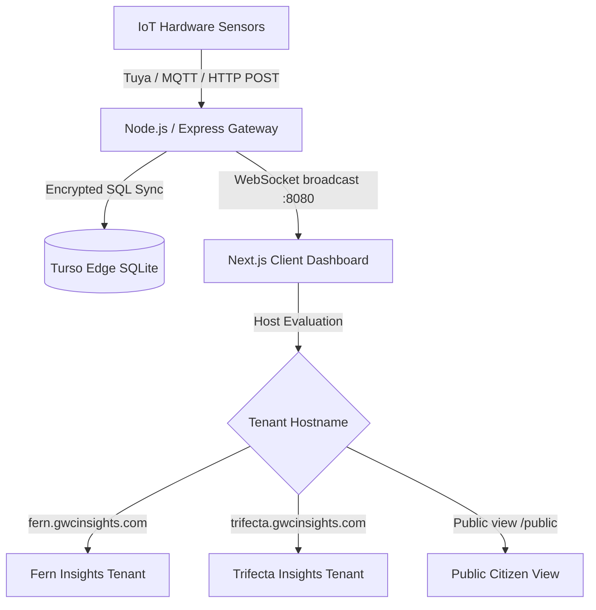

# 🌍 Planet Insights

> **Enterprise Environmental Intelligence & IoT Aquifer Telemetry Platform**  
> Real-time environmental monitoring, groundwater analytics, smart pump diagnostics, and atmospheric telemetry designed for high-precision multi-tenant estate management.

---

[](https://nextjs.org/)
[](https://www.typescriptlang.org/)
[](https://tailwindcss.com/)
[](https://turso.tech/)
[](https://developer.mozilla.org/en-US/docs/Web/API/WebSocket)
[]()

---

## 📌 Dashboard Showcase
c:\Users\Rohan\Pictures\Screenshots\Screenshot 2026-09-02 121705.png

---

## ✨ Core Features

### 💧 1. Groundwater & Aquifer Monitoring
- **Real-Time Depth Telemetry**: Continuous monitoring of borewell water levels, reservoir volume (Liters), and recharge kinetics.
- **Motor Automation & State Tracking**: Live status detection (`ON`, `OFF`, `COMMAND AWAITED`) with remote latching controls.
- **Multi-Borewell Switching**: Instant tabbed switching between multiple borewells (`Borewell 1`, `Borewell 2`, `Borewell 3`).

### ⚡ 2. Smart Pump Diagnostics & IRMS Speedometer
- **Custom Arc Speedometer**: Tuned semi-circular SVG dial displaying operating status across color-coded zones:
  - 🔴 **CHARGING** (Startup / Low current draw)
  - 🟡 **LOW** (Partial load)
  - 🔵 **MID** (Nominal operating range)
  - 🟢 **HIGH** (Peak throughput)
- **Phase Current Precision**: Real-time `IRMS` current readouts (Amperes) with sub-second WebSocket updates.

### 🧪 3. Water Quality Index (WQI)
- **Interactive Multi-Parameter Donut**: Visual scoring for drinking and irrigation safety:
  - **Volume**: Scaled target tracking.
  - **pH Balance**: WHO guideline adherence (6.5 – 8.5).
  - **Turbidity**: Light-scatter NTU measurement (< 5 NTU threshold).
  - **TDS**: Total Dissolved Solids tracking (ppm).
- **Water Health Capsule**: Embedded health rating inside the Ambient Comfort hub (`Optimal`, `Good`, `Fair`, `Alert`).

### 📈 4. Auto-Cycling Water Quality Trend
- **Autonomous Metric Rotation**: Cycles every 30 seconds across `Water Level` → `pH` → `TDS` → `Turbidity`.
- **High-Fidelity Visuals**: Multi-stop gradient fills, active glowing stroke lines, and manual override pills.

### 🫁 5. Comprehensive Atmospheric & AQI Intel
- **Pollutant Breakdown**: Dedicated telemetry for `PM2.5`, `PM10`, `CO2`, `TVOC`, `HCHO`, and `Temperature`.
- **Ambient Comfort Index**: Composite environmental index calculated from thermal comfort, relative humidity, and air purity.
- **Microclimate Weather Carousel**: Dual-panel carousel auto-rotating between live conditions and a 3-day regional weather outlook.

### 🧭 6. Geospatial Wind & Solar Tracking
- **Animated Wind Rose**: SVG compass displaying live wind degrees, gust speeds, and Beaufort breeze classification.
- **Leaflet Wind Stream Map**: Live interactive wind vector particle stream overlay.
- **Astronomical Arc**: Bézier curve tracking solar elevation and lunar phase with day/night progress synchronization.

---

## 🏛️ System Architecture



### Multi-Tenant Isolation
- **Domain-Driven Routing**: Evaluates host headers and client `window.location.hostname` to isolate estate properties:
  - `fern.gwcinsights.com` → **Fern Insights**
  - `trifecta.gwcinsights.com` → **Trifecta Insights**
- **Dynamic Title Hydration**: Client-side `MutationObserver` ensures consistent browser tab titles across Next.js static prerendering cycles.
- **Enterprise Provisioning**: Public registration is restricted; tenant gateways and administrator credentials are provisioned centrally via secure token hashes.

---

## 💻 Tech Stack

### Frontend
- **Framework**: [Next.js 16 (App Router)](https://nextjs.org/) with Turbopack
- **Language**: TypeScript 5.0 (Strict Mode)
- **Styling**: Vanilla Tailwind CSS + Glassmorphism UI tokens
- **Typography**: [Montserrat](https://fonts.google.com/specimen/Montserrat) geometric typography
- **Data Visualization**: [Recharts](https://recharts.org/) & Custom High-Performance SVG Gauges
- **Mapping**: [Leaflet](https://leafletjs.com/) with custom dark-matter map tiles
- **Icons**: [Lucide React](https://lucide.dev/)

### Backend & Ingestion
- **Server**: Node.js & Express
- **Real-Time Layer**: Native WebSocket (`ws`) with auto-reconnecting transport
- **Database**: [Turso](https://turso.tech/) (libSQL distributed edge SQLite) + Local SQLite fallback
- **Security**: Helmet, CORS origin whitelisting, IP rate limiting, SHA-256 password hashing

---

## 📂 Project Structure

```
AQI+Water/
├── just_frontend/
│   ├── backend/                      # Telemetry ingestion & WebSocket server
│   │   ├── middleware/               # Auth, rate-limiting & schema validation
│   │   ├── scripts/                  # Administrative credential provisioning
│   │   ├── utils/                    # Crypto token generators
│   │   ├── db.js / db-turso.js       # Turso & SQLite database wrappers
│   │   ├── server.js                 # API routes & WebSocket broadcaster
│   │   └── tuyaService.js            # IoT cloud integration service
│   │
│   ├── frontend/                     # Next.js 16 Web Application
│   │   ├── app/                      # App router (/, /login, /public, /signup)
│   │   ├── components/
│   │   │   ├── analysis/             # Water Analysis split & Health Index
│   │   │   ├── charts/               # Recharts donuts & forecast charts
│   │   │   ├── dashboard/            # Core dashboard tiles & widgets
│   │   │   ├── ui/                   # Shared design system components
│   │   │   └── environmental-core.tsx # SVG Speedometers & Gauges
│   │   ├── hooks/                    # WebSocket & viewport hooks
│   │   └── public/                   # Media assets, icons & map markers
│   │
│   └── README.md                     # Project documentation
```

---

## 🚀 Getting Started

### Prerequisites
- **Node.js**: `v18.17.0` or higher
- **npm**: `v9.0.0` or higher

### 1. Clone & Install

```bash
# Clone the repository
git clone https://github.com/your-org/planet-insights.git
cd planet-insights/just_frontend

# Install Frontend Dependencies
cd frontend
npm install

# Install Backend Dependencies
cd ../backend
npm install
```

### 2. Environment Configuration

Create a `.env.local` file in `just_frontend/frontend/`:
```env
NEXT_PUBLIC_WS_URL=wss://api.gwcinsights.com
NEXT_PUBLIC_API_URL=https://api.gwcinsights.com
```

Create a `.env` file in `just_frontend/backend/`:
```env
PORT=8080
CORS_ORIGIN=https://fern.gwcinsights.com,https://trifecta.gwcinsights.com
TURSO_DATABASE_URL=libsql://your-database.turso.io
TURSO_AUTH_TOKEN=your-turso-token
WEATHER_API_KEY=your-weather-key
```

### 3. Running Locally

**Terminal 1: Start Backend API & WebSocket Server**
```bash
cd just_frontend/backend
npm start
# Server listens at http://localhost:8080 (WS on port 8080)
```

**Terminal 2: Start Frontend Next.js Dev Server**
```bash
cd just_frontend/frontend
npm run dev
# Dashboard available at http://localhost:3000
```

### 4. Production Build

To validate TypeScript compilation and generate the static export:
```bash
cd just_frontend/frontend
npm run build
```

---

## 🔒 Security & Compliance

- **HTTP Headers**: Enforced HSTS, X-Frame-Options, Content Security Policy, and Referrer-Policy via `vercel.json` and Helmet.
- **Tenant Privacy**: Strict isolation of sensory payloads per tenant hostname; cross-tenant data leaks prevented at the database query layer.
- **Rate Limiting**: Brute-force protection on authentication routes (`10 attempts per 15 minutes`).
- **Data Integrity**: Sensor payloads verified via checksum validation before database persistence.

---

## 🤝 Support & Administration

For tenant onboarding, hardware gateway provisioning, or API access:
- **Administrative Support**: [gwcpidomain09@gmail.com](mailto:gwcpidomain09@gmail.com?subject=Access%20Request%20-%20Planet%20Insights)
- **Tenant Management**: Accounts are managed by estate system administrators. Self-registration is restricted.

---

*© 2026 Planet Insights. All rights reserved.*
